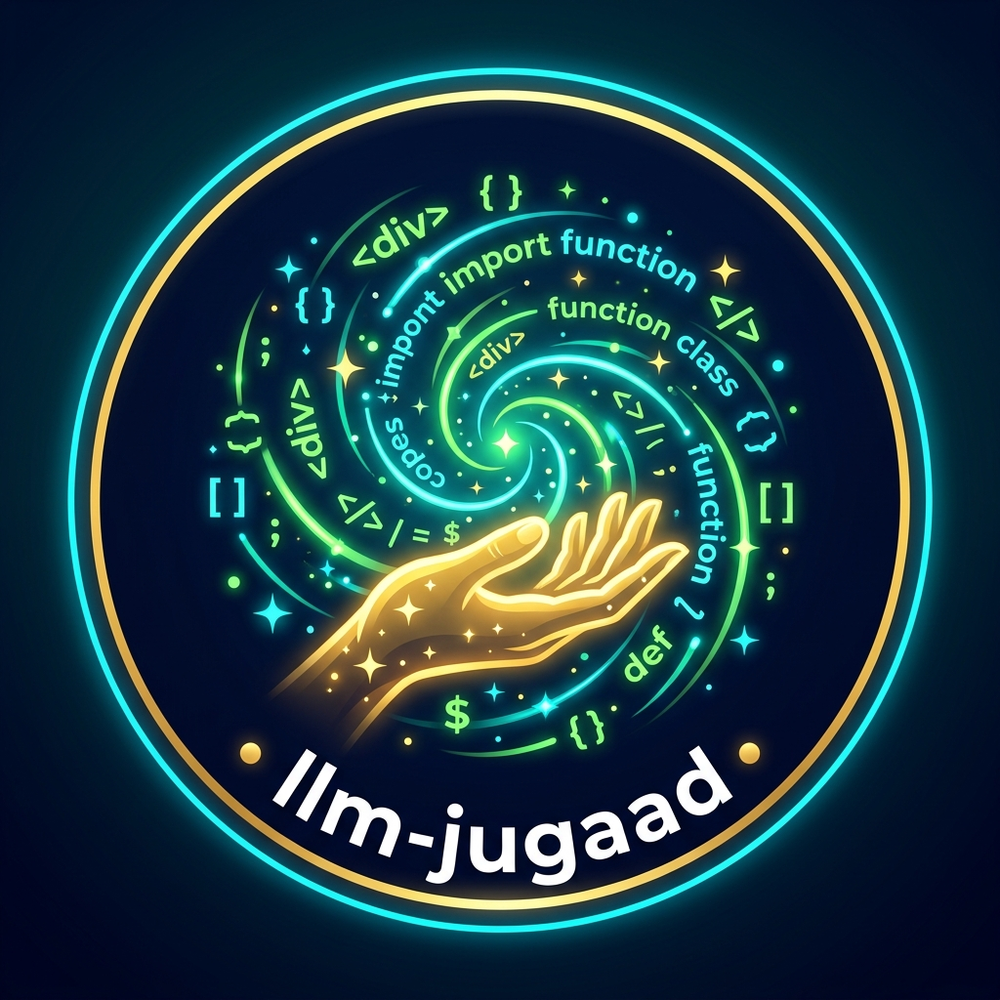

# 🧙‍♂️ jugaad-llm: The Free LLM Gateway

<p align="center">
  
</p>

<p align="center">
  
</p>

<p align="center">
  <b>✨ Conjure unlimited free LLM tokens from your free web sessions with pure Jugaad ingenuity. ✨</b><br>
  <i>Drop-in OpenAI- and OpenRouter-compatible API gateway running locally on your laptop.</i><br/>
  <i>Made with 💖 by  <a href="https://balajianbalagan.pages.dev/">Balaji Anbalagan</a></i>
</p>

<p align="center">
  <a href="https://github.com"></a>
  
  
</p>

<p align="center">
  <a href="#-quick-start-for-hackathons">Quick Start</a> •
  <a href="#-the-philosophy-of-jugaad">Why Jugaad?</a> •
  <a href="#-live-landing-page--github-pages">Live GitHub Pages</a> •
  <a href="#-supported-models--routing">Supported Models</a> •
  <a href="#-client-integration-examples">SDK Examples</a> •
  <a href="#-local-dashboard--test-console">Dashboard</a>
</p>

---

## 💡 The Philosophy of Jugaad

> **Jugaad (noun, Hindi / Indian):** *An ingenious, frugal hack; a clever workaround that solves complex problems with whatever tools are readily available.*

Why pay $20/month per provider or bleed through expensive API credits at 3 AM during a hackathon? You already have free-tier access to world-class LLMs like **ChatGPT (GPT-4o)**, **Claude (Claude 3.5 Sonnet)**, **Google Gemini**, **DeepSeek (R1/V3)**, and **Grok** through your browser.

**`llm-jugaad`** automates your authenticated browser sessions via Chromium, completely sidesteps Cloudflare bot challenges and Google OAuth restrictions, and exposes a unified, streaming OpenAI-compatible API gateway (`/v1/chat/completions`).

**No paid OpenAI/Anthropic API keys or credit cards required.**

---

## 🌐 Live Landing Page & GitHub Pages

The project features a sleek, responsive landing page ready to be hosted on **GitHub Pages**:

- 📁 **Source Directory:** [`docs/`](docs/)
- 📄 **Entry Point:** [`docs/index.html`](docs/index.html)
- 🎨 **Brand Assets:** [`docs/assets/`](docs/assets/)
- ⚙️ **Automated Action:** [`.github/workflows/deploy-pages.yml`](.github/workflows/deploy-pages.yml)

### Enabling GitHub Pages on Your Fork / Repo:

#### Option 1: GitHub Actions (Recommended ⚡)
1. Go to your repository on GitHub.
2. Navigate to **Settings** > **Pages**.
3. Under **Build and deployment** > **Source**, select **GitHub Actions**.
4. Push to `main` — the bundled workflow automatically publishes the page!

#### Option 2: Classic Branch Serving
1. Go to **Settings** > **Pages**.
2. Under **Build and deployment** > **Source**, select **Deploy from a branch**.
3. Choose branch: `main` (or `master`) and directory: `/docs`.
4. Click **Save**. Your site will be live at `https://<your-username>.github.io/<repo-name>/`.

---

## ⚡ Quick Start for Hackathons

### 1. Install Dependencies

```bash
git clone <repo>
cd useful-projects

# Install dependencies
pip install -r requirements.txt
```

### 2. Configure Environment

Copy `.env.example` to `.env`:

```powershell
Copy-Item .env.example .env    # Windows PowerShell
# or cp .env.example .env      # macOS / Linux
```

### 3. Log In to Your Free Accounts (One-Time Setup)

You have multiple easy ways to authenticate:

#### Option A: Import Your Existing Chrome Profile & Google Account (Recommended ⚡)
If you already use Chrome and have logged-in accounts (like your Google account), import your profile in one click:

```bash
# 1. List all discovered Chrome profiles with their Google emails
python start.py --list-profiles

# 2. Import your profile into llm-jugaad
python start.py --import-profile
```

Your Google login sessions, cookies, and local state are copied into `data/chrome_profile/` in seconds. When signing into ChatGPT or Claude, simply click **"Continue with Google"** with 1 click!

#### Option B: Interactive Login Window (Bypasses Bot Checks & Cloudflare)
Launch the interactive login setup:

```bash
python start.py --login
```

This launches a **native, un-automated Google Chrome window** with tabs for your providers:
- **ChatGPT** (`https://chatgpt.com`)
- **Claude** (`https://claude.ai`)
- **DeepSeek** (`https://chat.deepseek.com`)
- **Grok** (`https://grok.com`)
- **Google Gemini** (`https://gemini.google.com/app`)
- **Perplexity** (`https://www.perplexity.ai`)
- **Mistral Le Chat** (`https://chat.mistral.ai/chat`)
- **HuggingFace Chat** (`https://huggingface.co/chat`)
- **Poe** (`https://poe.com`)
- **K2 Think** (`https://k2think.ai`)
*(Note: **Ollama** runs directly via `http://localhost:11434` or configured Cloud endpoint without browser tabs)*

Because it launches native Google Chrome without automation flags or Playwright CDP hooks:
- **Google OAuth ("Sign in with Google") works seamlessly** without *"This browser or app may not be secure"*.
- **Cloudflare Turnstile bot checks PASS normally.**

Sign in to your free accounts in the open tabs. Once done, return to the terminal and press **`[ENTER]`**. Your sessions are safely stored in `data/chrome_profile/` and will persist across restarts.

#### Option C: Live Browser CDP Connection (Zero Setup)
If you prefer using your currently running Chrome browser directly without copying anything:

```bash
# 1. Launch Chrome with remote debugging
python start.py --launch-chrome

# 2. Start the gateway connected to it
python start.py --cdp 9222
```

#### Option D: Validate All Logged-In Sessions (Zero Overhead)
To instantly test and verify which providers are logged in and ready:

```bash
python start.py --validate
```

This runs a rapid status check across all 11 providers, tests DOM chat input selection, and prints an authenticated status table.

### 4. Start the Gateway with Public Ngrok Tunnel

```bash
python start.py --tunnel
```

The gateway automatically starts the local server and launches a secure, temporary HTTPS ngrok tunnel. It prints a banner ready to copy-paste into your hackathon app's `.env`:

```env
OPENAI_BASE_URL="https://xxxx-xx-xx.ngrok-free.app/v1"
OPENAI_API_KEY="sk-hackathon-token"
```

---

## 🎛️ Local Dashboard & Test Console

When running `python start.py`, navigate locally to:

- 🏠 **Landing Page**: `http://localhost:4000/`  
  Interactive token conjurer playground, SDK integration code tabs, and provider matrix.
- ⚡ **Control Center**: `http://localhost:4000/dashboard`  
  View real-time authenticated session chips, launch interactive login browsers with 1 click, inspect live logs, and monitor token counters.

---

## 🤖 Supported Models & Routing

Any OpenAI-compatible library can specify these model IDs:

| Model ID | Target Free Provider | Aliases |
| :--- | :--- | :--- |
| **`auto`** | Smart load-balanced routing (least loaded active service) | `default`, `free`, `fastest` |
| **`chatgpt`** | ChatGPT Web Free Session | `gpt-4o`, `gpt-4o-mini`, `gpt-4`, `chatgpt-free` |
| **`claude`** | Claude.ai Free Session | `claude-3-5-sonnet`, `claude-3-sonnet`, `claude-haiku`, `claude-free` |
| **`deepseek`** | DeepSeek Web Free Session | `deepseek-chat`, `deepseek-v3`, `deepseek-r1`, `deepseek-free` |
| **`grok`** | Grok Web Free Session | `grok-2`, `grok-3`, `grok-mini`, `grok-free` |
| **`gemini`** | Google Gemini Free Web Session | `gemini-1.5-flash`, `gemini-1.5-pro`, `gemini-2.0-flash`, `gemini-pro` |
| **`perplexity`** | Perplexity AI Search/Chat Session | `sonar`, `sonar-small`, `pplx`, `perplexity-ai` |
| **`mistral`** | Mistral Le Chat Free Session | `lechat`, `mistral-large`, `mistral-small`, `codestral` |
| **`huggingface`** | HuggingFace Chat Free Session | `hf`, `huggingchat`, `hf-chat`, `command-r` |
| **`poe`** | Poe Free Tier Session | `poe-chat`, `poe-assistant`, `assistant-poe` |
| **`k2think`** | K2 Think Reasoning Free Session | `k2-think`, `k2`, `k2think-v2`, `k2-reasoner` |
| **`ollama`** | Ollama Cloud / Local Instance | `ollama-cloud`, `llama3`, `llama3.1`, `qwen2.5` |

> 🛡️ **Smart Overload Protection & Zero-Failure Routing**:
> - If a provider is **not logged in**, the router skips it immediately so you never hit broken tabs or auth timeouts.
> - Requests are dynamically distributed across services based on **in-flight count** and **least-recently-used** timestamps.
> - If any service experiences a temporary rate limit, it enters a 60-second cooldown while the remaining providers seamlessly take over.

---

## 💻 Client Integration Examples

### Python (OpenAI SDK)

```python
from openai import OpenAI

client = OpenAI(
    base_url="http://localhost:4000/v1",  # Or https://xxxx.ngrok-free.app/v1
    api_key="sk-hackathon-token"
)

# Streaming response directly from your ChatGPT/Claude session
response = client.chat.completions.create(
    model="auto",  # or "chatgpt", "claude", "deepseek", "grok"
    messages=[
        {"role": "system", "content": "You are a hackathon assistant."},
        {"role": "user", "content": "Pitch a high-impact AI healthcare project."}
    ],
    stream=True
)

for chunk in response:
    content = chunk.choices[0].delta.content or ""
    print(content, end="", flush=True)
```

### TypeScript / Next.js AI SDK

```typescript
import { createOpenAI } from '@ai-sdk/openai';
import { streamText } from 'ai';

const localGateway = createOpenAI({
  baseURL: 'http://localhost:4000/v1',
  apiKey: 'sk-hackathon-token',
});

const result = await streamText({
  model: localGateway('claude'), // routes to your Claude session!
  prompt: 'Write an executive summary for our pitch deck.',
});
```

### cURL

```bash
curl http://localhost:4000/v1/chat/completions \
  -H "Authorization: Bearer sk-hackathon-token" \
  -H "Content-Type: application/json" \
  -d '{
    "model": "deepseek",
    "messages": [{"role": "user", "content": "Explain quantum computing in one sentence."}],
    "stream": false
  }'
```

---

## 🔄 Zero-Cost API Fallback (Optional)

If you ever want an extra safety net alongside browser sessions, you can enable genuine 100% free official keys (which require **zero credit cards** and never expire):
- **Google AI Studio (Gemini 2.5 Flash)**: Free 15 RPM at [aistudio.google.com](https://aistudio.google.com).
- **Groq**: Free high-speed Llama-3.3-70B tier at [console.groq.com](https://console.groq.com).

Set `ENABLE_API_KEYS=true` and paste your free key in `.env`.

---

## 🛠️ Commands Reference

```bash
# Start locally (Landing page at http://localhost:4000/, Dashboard at /dashboard)
python start.py

# Start with visible login window for free accounts
python start.py --login

# Start and expose via public ngrok tunnel
python start.py --tunnel

# Start on custom port
python start.py --port 8000

# Run automated tests
python -m pytest -p no:cacheprovider
```

---

<p align="center">
  <b>llm-jugaad</b> — Crafted with 🧡 for hackathon champions and unstoppable builders.
</p>
