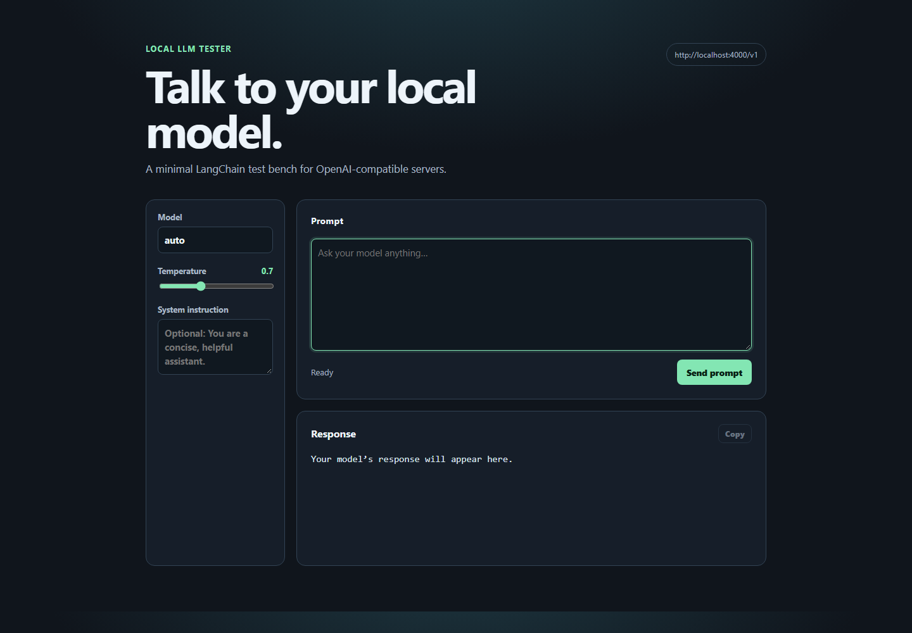
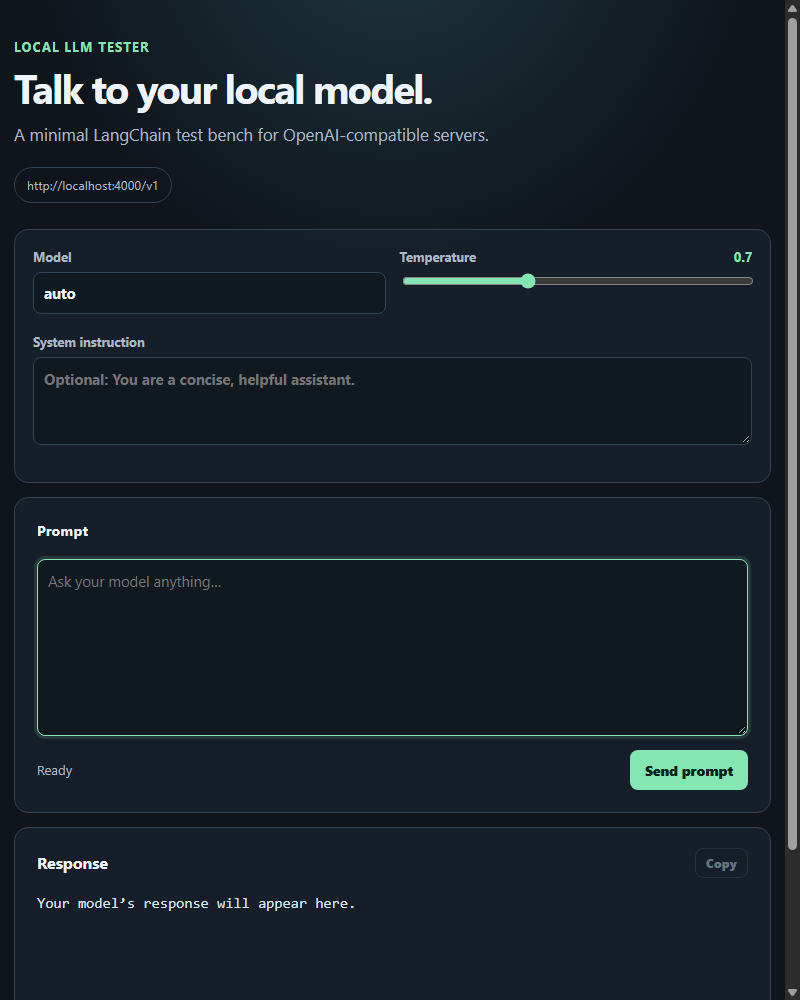

# Usage examples

The screenshots below are captured from the local tester. They show the screen before a prompt is sent at desktop and narrow (800px) widths.





## 1. Configure the gateway

Create `.env` from `.env.example` and use the gateway values:

```env
OPENAI_BASE_URL=http://localhost:4000/v1
OPENAI_API_KEY=sk-hackathon-token
LOCAL_MODEL=auto
```

`auto` is the gateway's load-balanced route. To pin a provider, replace it with a supported ID such as `chatgpt`, `claude`, or `deepseek`.

## 2. Run the tester

```powershell
.\.venv\Scripts\Activate.ps1
uvicorn app:app --reload
```

Open `http://127.0.0.1:8000`.

## 3. Send a prompt

1. Confirm the endpoint badge reads `http://localhost:4000/v1`.
2. Leave **Model** as `auto`, or enter a specific provider ID.
3. Optionally add a system instruction and adjust temperature.
4. Type a prompt and select **Send prompt**.
5. The answer appears under **Response**; use **Copy** to place it on the clipboard.

Example prompt:

```text
Explain what an OpenAI-compatible API is in one sentence.
```

## Current verification result (2026-09-25)

| Check | Result |
| --- | --- |
| FastAPI route and OpenAPI contract | Passed |
| Static HTML, CSS, and JavaScript assets | Passed |
| Public configuration does not expose API key | Passed |
| Invalid chat payload returns validation error | Passed |
| Python compilation | Passed |
| Gateway model catalog and completion | Blocked: `localhost:4000` was unavailable during the final test |
| End-to-end model response | Blocked by the unavailable gateway; the tester correctly surfaces a 502 response |

When the gateway is available again, verify that a provider session is signed in via its dashboard (`http://localhost:4000/`) or run its `python start.py --validate` command, then resend the example prompt.
